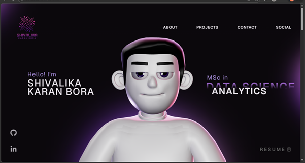

# Shivalika Karan Bora Portfolio

Interactive personal portfolio website built to showcase my backend engineering experience, MSc Data Science journey, technical projects, and skills.



## Overview

This project is a modern portfolio website created with React, TypeScript, Vite, GSAP, and Three.js. It presents my professional experience, academic background, featured projects, technical skills, and contact information in an interactive and recruiter-friendly format.

## Features

- Responsive portfolio layout
- Interactive hero section with 3D character
- Separate sections for About, Work Experience, Academics, Projects, and Tech Stack
- GitHub and LinkedIn integration
- Downloadable resume link
- Smooth animations and modern UI styling

## Tech Stack

- React
- TypeScript
- Vite
- GSAP
- Three.js
- CSS

## Featured Projects

### Fluffy AI Assistant

Python-based desktop AI assistant with voice and text command processing, SQLite-backed data handling, and workflow automation.

### Image Analysis Project

GUI-based Python application for grayscale conversion, blur, cropping, histogram generation, edge detection, thresholding, and RGB channel operations.

### Personal Portfolio

Interactive portfolio website built to present projects, work experience, academic background, and technical skills.

## Getting Started

```bash
npm install
npm run dev
```

The app runs locally at `http://localhost:5173`.

## Build

```bash
npm run build
```

## Contact

- Email: `shivalikauni@gmail.com`
- LinkedIn: `https://www.linkedin.com/in/shivalika31`
- GitHub: `https://github.com/shivalika3101`
